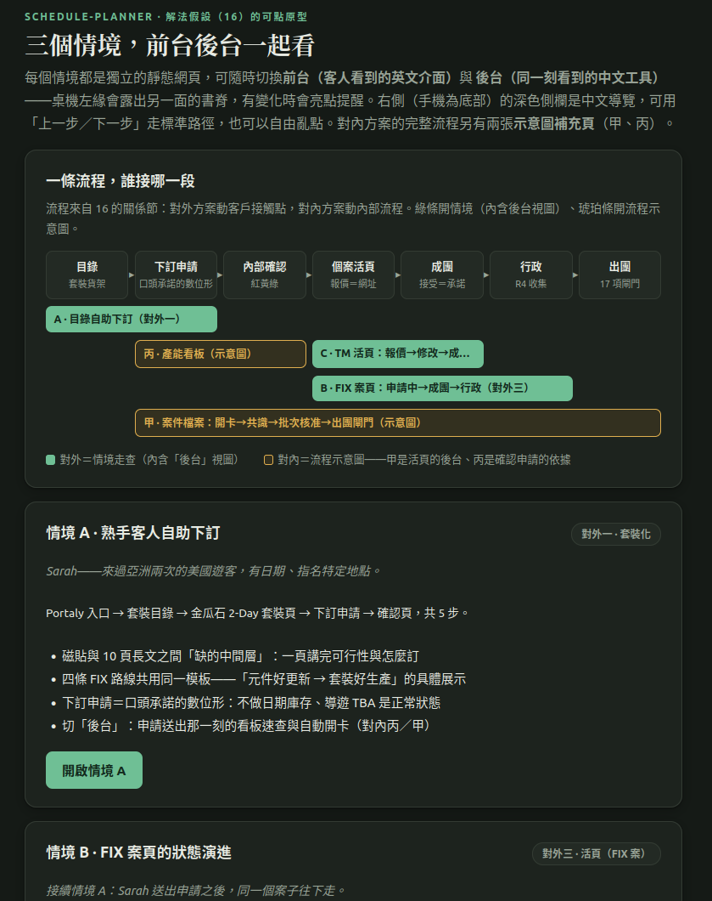
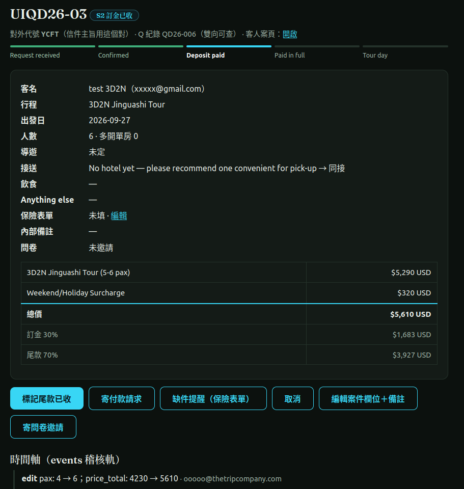

# 會動的東西，和別人接得住的東西

接國外旅客的生態旅行社｜2026-09

摘要：老闆想要一個行程產生器。量了現況之後改做套裝行程的線上下單，用 POC 確認可行，交出正式上線前的待辦報告書。

第一次見面，老闆把問題說成一句話：客製行程和報價只有他做得來，而且非常花時間。材料都在，多年的報價單、行程文件、和客人來回的每一封信，散在信箱和雲端硬碟裡。他平常用 AI 的方式，是網頁版的對話，還有整合在 Google 服務裡的那種助理，問一句答一句，資料留在原地。

ddio 看他平常處理數位工具的樣子，覺得他不該被特定服務的 AI 界面綁住，於是提議這次直接用 coding agent，也就是會自己讀檔案、寫程式、把東西跑起來的那一種。老闆答應了。開始沒幾天，他的 agent 就把信箱和雲端硬碟裡的東西撈了下來，接著兩個人各自寫程式抽資料，各自在自己的工作環境裡帶著 agent 做事，隔一段時間碰面對一次進度。合作的形式因此不是一般的委託，比較像互相學習：一起把一個 POC 做出來，他順便換一種用 AI 的方式，ddio 不負責教，一起做本身就是練習。

這是一家接國外旅客的生態旅行社。老闆是唯一同時懂領域、又能用外語寫作的人，另有一位行政同事、幾位外包導遊，金流和出團透過合作的旅行社。他原本想要的是一個行程產生器。一個多月下來，大約三分之一的時間花在用原型對齊要做什麼，最後做出來的是套裝行程線上下單流程的 POC，用它確認了可行，另外交了一份對方能接受的、正式上線前的待辦報告書。中間的每一段，幾乎都在講同一件事：agent 讓一個人很快做出很多會動的東西，每一個看起來都像答案，可是會動，和別人接得住，是兩回事。

## 先弄清現況，再決定做什麼

起手式很保守，先不做工具，先把現況弄清楚。資料抽出來以後，頭一輪量出來的東西，推翻的假設比證實的還多。

原本以為旺季回信會變慢，量出來跟季節無關，是老闆人在野外帶團的那幾天回得慢。這差很多：如果是旺季，解法是加人；如果是人在山上，解法是讓別人接得住。原本以為客人一直問，是因為文件不夠完整，資料攤開來，該講的每次都有附，多數案子還是得另外再溝通一次；把文件寫得更完整，安心的只有寫的人。

最要緊的一個發現在客人的第一封信裡。信都很短，多數已經講好日期、地點、想看什麼，那已經是一張訂單的樣子，不是「請幫我設計行程」。多數詢問需要的是一個可以直接下訂的入口，老闆的手工應該留給真正的客製。套裝行程件數多、重複的手工最多、規則也最接近寫清楚了，是最交得出去的一段，做完，客製要用的地基也順便有了。所以先做套裝，不做產生器。這個轉向不是誰說服誰，是資料攤開之後兩個人一起看到的。

## 原型是拿來對齊的，不是拿來做漂亮的

ddio 不愛寫厚厚的規格書請人想像，習慣每一輪都做出可以點來點去的東西，讓大家有地方指著講。有了 agent，這件事從幾個小時變成幾分鐘。

對齊那一段的節奏是這樣的。某一天，解法假設那份文件在一天之內改寫了十幾次：早上先收斂出五個流程優化的解，中午覺得收得太早，退回去發散成三個方向，下午補上每個方向的接觸點、誰的角色會變、處理到哪些痛點。兩天後，三個情境的靜態原型上線，桌機左緣露出一條書脊，翻過去就是同一刻後台看到的畫面。隔天老闆回了一句接送地點的實務考量，客人從哪裡出發，決定他算哪一種產品，這句話當天落進分析、設計和表單原型。再過一週，做了一次方向級的調整：加進「工具複雜度有上限」這條約束，把方向拆成對外和對內兩類，移掉兩個看起來合理、但量出來效益不高的方向。到這裡，才開始寫會跑的系統。

*對齊用的靜態原型。上半是整條流程和各方案接在哪一段，下半是可以點進去走一遍的情境。*

好的一面是真的好。老闆和同事的回饋具體到哪一頁、哪一段、改成什麼，當天就能改；很多專案的回饋只有「感覺怪怪的」，那種只能用猜的。另一面也跟著來：東西一會動，「這裡調一下會比較完整」就出現了，ddio 得一再說明，POC 是要驗證主要流程，不是要把它做漂亮。設計圈對這件事還在爭。老派的說法是草圖就該模糊，太完整的東西，大家只會挑細節；新派說做東西的成本歸零了，老規矩該改。Nielsen Norman Group 去年做過實地研究，講得很具體：

> 把離定案還很遠、卻已經打磨得很精緻的高擬真 AI 原型拿給利害關係人看，又沒有先框好它是什麼，可能會毀掉你們之間的溝通。例如，視覺層級都還沒定，大家卻開始爭論按鈕的顏色。
>
> —— Wang & Brown，〈Good from Afar, But Far from Good: AI Prototyping in Real Design Contexts〉，Nielsen Norman Group，2025 年 10 月（中譯：Claude）

ddio 是帶著新派的心情開工的，結案時站得比較中間：做得多像真的，不會改變回饋的量，但會換掉回饋的種類。做東西便宜之後，對齊反而成了最花時間的一段，而且是值得花的一段。

## 會動，和別人接得住，是兩件事

老闆換了工具以後，產出變得非常多。文件、決策紀錄、協作規則，什麼都有，每天寫出來的東西比 ddio 多得多。第一週他看了 ddio 的工作紀錄，問了一句：為何你的東西比較專業？

先把答案講出來的不是 ddio，是他自己。他請他的 agent 不留情面地盤點整個專案，得到的結論很直接：產出很多，真正交到別人手上、有人在用的很少。卡住的不是工具，是他自己，AI 的產出要他看過才算數，而 AI 寫的速度遠遠快過他看的速度。有一件事他一直沒辦法動工，他的說法是「我還在處理我自己和我自己的共識」。一個人幾天就能產出一整個團隊份量的想法，也就產出一整個團隊份量的意見不合，只是吵架的雙方都是自己。他的工作紀錄為了管住這件事，長出一整套規矩，每一條都是出過事才加的，都沒錯，但那是十人團隊在用的流程，現在全壓在一個人身上。

ddio 這邊也一樣。這次沒做訪談，直接讀老闆的原始資料和他的工作紀錄，訪談問到的是「理想上我會怎麼做」，紀錄裡留下的是「我實際上做了什麼」，這是有了 agent 才做得到的田野調查。可是 agent 很容易被對方的紀錄牽著走，它分不出來一份文件到底是隨手的點子、一次嘗試、一項要求，還是基本原則，然後根據這些寫出一份看起來很像樣的計畫。有一次計畫上寫「需要的資料本地都有了」，實際一跑，缺了最關鍵的那一塊。從此 ddio 在每份計畫開頭多寫一行：對方既有的設計只是參考，不是答案。

收斂、保守、一步一步推進，是工程師被一個個專案磨出來的習慣。現在的 agent 會盤點、會提醒，老闆的 agent 也提醒過他，當推翻一個決定變得很麻煩，人就會傾向不推翻，對一個方向還在快速變動的專案，僵化比混亂更危險。但提醒完要不要停下來，agent 沒辦法替人決定。

## 工具不能複雜到只有一個人會用

這條約束是對齊那一段長出來的，之後每個決定都在用它。

什麼情況都能算的計價引擎，聽起來最直覺，可是做完整之後，只有老闆會用，也只有老闆抓得到 bug；「只有一個人會」這個問題沒有消失，只是從流程搬進了工具。所以它出局了，套裝行程的價格用查表，客製留給人工。

反過來說，老闆的判斷要被固定下來，而不是被取代。行程上的時間要寫「09:00 前後」，不要寫精確的區間，客人才會去看「會看到什麼」，而不是盯著幾點。這種事工程師想不到，帶過團的人才知道；系統能做的，是把這種判斷固定下來，讓它每次都被照做。同事看了一輪報價，抓出週末加價沒有算進去，這個 bug 後來被寫成驗收項目。有人接得住，錯才抓得到。

後台是照著行政同事設計的，她的專業在行政與金流，要接手的人很早就確定是她。不用問老闆，就看得到每個案子到哪、還缺什麼、下一步該按哪顆按鈕；容易手滑的動作會再問一次，按錯了有一小段時間可以反悔。

*POC 的後台案件頁。「標記尾款已收」只是一顆按鈕，錢走合作旅行社原本的管道，系統只負責記帳。*

收款那顆按鈕看起來很陽春，寫待辦報告書的時候才確認這樣就對了：金流、對帳、退款三大塊一次省掉，少一塊要維護的東西，就少一塊只有某個人懂的東西。報告書上的項目也刻意不估人天，改估複雜度。有了 agent，打字早就不是瓶頸，一件事多久能落地，要看得做幾次決定、卡多少外部的事、做錯的代價多大；標「高複雜度」的地方，意思是這裡最需要老闆一起確認，要預留的是他的時間，不是工程時間。

## 兩邊各做各的，差別自己會浮出來

老闆做事很發散。ddio 沒有花力氣勸他收斂，互相學習的形式剛好可以換一種做法：兩邊各做各的，讓他自己比較兩種做法的結果。

各做各的不等於放著不管。前兩次會議，ddio 花了不少時間看他實際上怎麼給 agent 下指令，也把自己的指令給他，當場在他的環境跑起來，不教他該做什麼，只是讓他手上多一種做法可以比。反過來，ddio 的原型一上線，他就把網址丟給他的 agent，要它拿 ddio 的分析去跟手上的資料逐項對帳。對出來，有些地方是兩邊各自想到同一個方向，這比誰說服誰都有力。他也常常跑在前面：合作初期 ddio 整理了一張價格對不起來的對照表，準備當成發現提出來，一查才知道他兩天前就把每個品項都核定完了。他自己做交叉比對抓錯，也老老實實把自己出過的錯記在表裡，這是這次分析能做準的原因之一。

幾個禮拜後，他在自己的紀錄裡寫下一段體悟：命令列加 AI 像是終極解答，但只限於他一個人處理所有事情的時候。他盤點自己這段時間做的幾個工具，唯一一個同事不用靠 agent 就能獨立使用的，是一支算套裝報價的小計算器，價目表加固定規則，包成只有自己人打得開的一頁，同事把資料貼進去、結果抓出來；裡面一行 AI 都沒有。東西交不交得出去，看的是背後的規則有沒有寫清楚，跟用了什麼技術無關。「工具不能複雜到只有一個人會用」和他這段話，是兩邊各自走到同一個地方。顧問這行的老傳統叫過程諮詢，早就說客戶自己想通的才會持久，但它講的是引導對方反思，沒講到可以讓對方直接體驗差異。這招現在行得通，是因為有了 agent，自己走一遍變得很便宜。

到後期，他自己把分工講得很清楚：資料、還有他覺得有用的工具，他會整理好；至於怎麼上線、該不該上線、用什麼技術、之後怎麼維護，交給 ddio 判斷。他沒有少做，還是做得一樣多，變的是他知道哪一段該交給誰。原本計畫好的驗證也跟著調整：本來要邀幾位熟客走一遍假訂單，連演習規則都寫好了，後來沒做，有意義的受測者不好找，而老闆判斷這已經明顯比現況好。改成請一位局外人試用、填一份問卷，找行程、填表單、看狀態都給了高分，最低分的一題是「每一步之後，我知道接下來會怎樣、我要不要做什麼」，而那時候頁面上已經有進度條了。我們看得懂的狀態，不等於客人接得住的指示。客人到底會不會留在網站上把事情辦完，等上線後看實際行為就知道了。

回頭看，這一案裡溝通長出來的地方都很具體：一個會動的畫面，讓回饋落到哪一頁哪一段；兩邊的工作紀錄定期對帳，讓彼此看到各自走到同一個方向；「09:00 前後」這種判斷，工程師得先聽懂，才寫得進系統；後台照著行政同事的專業設計，因為之後要接住它的是她。以前寫程式很貴，數位專案常常只剩下討論怎麼開發；現在做東西便宜了，剩下的難處幾乎都是溝通，誰看得懂、誰信得過、誰接得下去。八小時換不來一個組織的數位能力，它能做的是把一件事驗證清楚，並且一起完整走一輪，從想法、做出會動的東西，到判斷它該不該上線、誰接得住。走過一輪還有一個實際的好處：溝通成本看得見了，正式上線的範圍和報價都比較拿捏得準。

## 下次會改的事

發散的時候，沒有一直記得要收斂。發散本身沒問題，一條路沒走到看得出它不值得做，就沒辦法對剩下的路有信心，這一案被否決的方向比被採用的多，每個都留了理由。問題是主線出現得比該出現的時間晚。收斂不出主線的時候，應該當下停下來弄清楚為什麼，而不是繼續往下做；方向還沒定，對方工作紀錄的每一次變動都是成本。

開案時沒講清楚 8h-probe 在做什麼。它做的不只是一個 POC，而是同時驗證兩件事：這個組織適不適合這樣的合作方式，以及 ddio 認為最關鍵、也最不確定的那一段流程走不走得通。所以結束之後的下一步本來就不只一種，可能是一個可以直接用的東西，可能還要打磨，也可能是直接讓內部的人接手。這一案沒有在一開始把這幾種結局攤開來講，過程中大家對「做出來的東西是什麼」的期待就各自想像；回饋也沒有好好列管，只能來一個處理一個。

資料存取靠的是信任，不是制度。整包原始資料加工作紀錄全讀，超過顧問業「最小必要」的原則。這次的做法是原始資料不進共用的紀錄、文件只留彙總後的結論，但換一個還沒那麼熟的對象，這個方法不一定行得通。

所以之後每一案會先做幾件事：開案先講清楚這次要驗證的是什麼、結束後可能有哪幾種下一步，並約定回饋怎麼列管；發散可以，但要記得收，收不出主線就馬上弄清楚原因；對方有自己的工作紀錄，就先約好多久對一次。這幾條是從這一案長出來的，下一個組織會再長出不一樣的幾條。

*這篇文章由 ddio 提供資料與方向，指揮 Claude 寫成。*

---

*編修紀錄*
- 2026-09-25：標頭不再標「前篇」。
- 2026-09-25：業主審閱通過，移出 drafts 刊出；後篇追蹤項目另存於 drafts。
- 2026-09-25：改為第三人稱文章體，語氣收斂；標題改為 take away；速寫併入開頭，補「三分之一時間用原型對齊」一節並嵌兩張截圖；文獻改為直接引文；移除假設讀者懂 repo 的用語與「我要傳達什麼」的宣言句；兩張截圖經 ddio 去識別化後嵌入，檔名依內容對調。事實勘誤：資料原在信箱與雲端硬碟、開始後由老闆的 agent 撈下再各自抽取；老闆是這次才由 ddio 建議改用 coding agent；最終產出是 POC 加正式上線前的待辦報告書。前一版存於 `2026-08-trial-01.v2-口語.md`。
- 2026-09-23：正式版確定接著做；補上 ddio 的核心關懷；「那還找我幹嘛」補回饋機制；「交接為什麼這麼難」補 agent 提醒不等於有人停下來；後篇追蹤加入官網。
- 2026-09-21：定標題；語氣改口語；「老闆自己的結論」移到做法之後，作為標題問題的回答。前一版存於 `2026-08-trial-01.v1-正式語氣.md`。
- 2026-09-21：以「會動 vs. 別人接得住」為主軸重排，十四節收為六節。
- 2026-09-20：由進行中草稿改寫為前篇結案紀錄。
